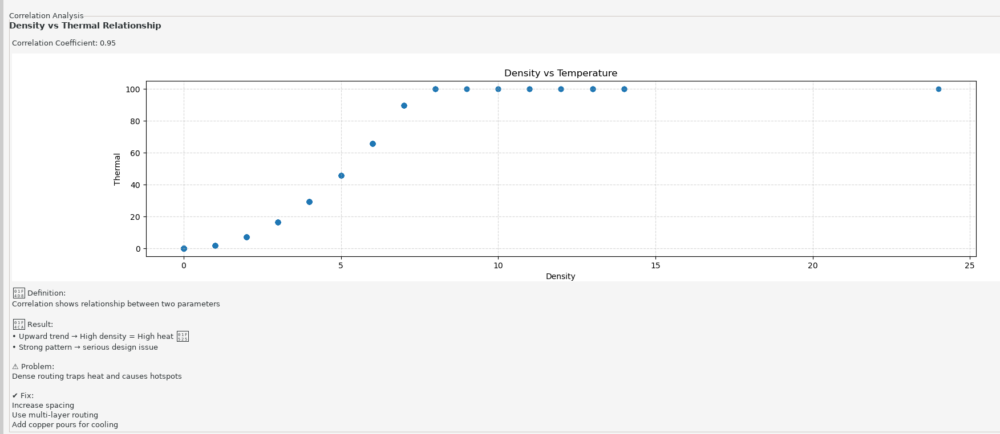

# PCB Manufacturability Risk Analyzer

A KiCad plugin that analyzes PCB designs to identify manufacturing risks, thermal hotspots, EMI concerns, and design optimization opportunities. The plugin generates visual heatmaps and detailed reports to help engineers improve board reliability and manufacturing feasibility.

## Features

### 🔍 **Trace Analysis**
- Analyzes trace widths and density across the PCB
- Identifies high-density regions that may cause manufacturing issues
- Detects under-utilized areas and optimization opportunities

### 🔥 **Hotspot Detection**
- Identifies regions with high trace density combined with thermal stress
- Maps critical zones that may overheat or reduce component lifespan
- Provides actionable recommendations for hotspot mitigation

### 🌡️ **Thermal Analysis**
- Generates temperature maps based on trace density and thermal characteristics
- Calculates ambient temperature effects and thermal scaling
- Identifies regions at risk of thermal failure

### 📡 **EMI Analysis**
- Analyzes electromagnetic interference risk areas
- Identifies zones with potential signal integrity issues
- Helps optimize trace routing for EMI reduction

### 📊 **Correlation Analysis**
- Examines the relationship between trace density and thermal characteristics
- Provides statistical insights into design patterns
- Helps identify coupled risk factors

### 📈 **Visual Heatmaps**
- Density heatmap: Shows trace concentration across the board
- Thermal heatmap: Displays temperature distribution
- EMI heatmap: Highlights EMI risk zones
- Color-coded visualization for easy identification of problem areas

## Installation

1. Place the entire `pcb_risk_analyzer` folder in your KiCad plugins directory:
   ```
   ~/.local/share/kicad/8.0/scripting/plugins/
   ```

2. Restart KiCad to load the plugin

3. The plugin will be available in KiCad's Tools menu

## Usage

1. Open your PCB design in KiCad
2. Navigate to **Tools → PCB Risk Analyzer**
3. The analysis window will display comprehensive information about your board's manufacturability

### Accessing the Plugin


*Access the plugin from KiCad's Tools menu → External Plugins → Smart PCB Manufacturability Analyzer*

---

## User Interface Walkthrough

### 1. Key Manufacturing Metrics

The plugin starts by displaying critical trace statistics for your PCB:


*Key metrics including Average Track Width, Minimum Track Width, Standard Deviation, Via Analysis, and insights about manufacturing stress*

---

### 2. Visual Heatmap Analysis

The centerpiece of the analysis shows four synchronized heatmaps across your entire PCB:


**Four Color-Coded Heatmaps:**
- **Density Heatmap** (Left): Shows trace concentration - Red = high density (potential issues), Green/Blue = well-distributed
- **Thermal Heatmap**: Displays heat generation patterns based on current and trace density
- **EMI Heatmap** (Right): Highlights electromagnetic interference risk zones
- **Temperature Map** (Far Right): Shows actual temperature distribution (°C) with red zones indicating critical temperatures

---

### 3. Hotspot Analysis

Understanding critical regions:


**What is a hotspot?**
- Regions with high trace density combined with high thermal stress
- Red boxes in the heatmap indicate critical zones
- May cause overheating, component failure, or reduced lifespan

**Recommended Fixes:**
- Redistribute traces to balance density
- Increase spacing between traces
- Add copper pours or ground planes for heat dissipation
- Use multi-layer routing strategies

---

### 4. Track Width Distribution Analysis

Histogram showing trace width consistency:


**What this shows:**
- Distribution of track widths across your PCB
- Narrow spread = consistent, well-designed routing
- Wide spread = potential current flow issues

**Interpretation:**
- Narrow distribution = Good design consistency
- Multiple peaks = Inconsistent routing requiring attention
- Problem: Inconsistent widths can cause uneven current flow and heat generation

---

### 5. Risk Distribution Analysis

Overall board safety assessment:


**Risk Zones:**
- **Green (Safe)**: 93.5% of the board - Well-designed, no immediate concerns
- **Yellow (Moderate)**: Potential issues that should be monitored
- **Red (Risk)**: High-risk areas requiring immediate attention

**Risk Count Comparison:**
- Clear visualization of how many grid cells fall into each category
- Helps prioritize design improvements

---

### 6. Suggestions for Improvement

Actionable guidance based on detected issues:


**Features:**
- **Detected Issues** highlighted in color-coded boxes
- **Specific Fixes** for each identified problem
- **Final Manufacturability Score**: Rate your design quality (0-100)
- **Educational Explanations**: Learn about each metric and its real-world impact

**Manufacturability Rating:**
- Indicates board readiness for production
- Shows what can be improved for better reliability

---

### 7. Problem Identification and Solutions

Detected issues with practical fixes:


**Common Issues Found:**
- ✗ Inconsistent routing
- ✗ Congestion detected

**Provided Solutions:**
- ✓ Maintain uniform width
- ✓ Follow DRC rules
- ✓ Spread traces evenly
- ✓ Use multi-layer PCB

---

### 8. Correlation Analysis

Statistical relationship between density and thermal characteristics:



**Density vs Thermal Relationship:**
- **Correlation Coefficient: 0.95** (very strong positive correlation)
- Shows how trace density directly impacts heat generation
- Helps understand coupled risk factors

**Key Insights:**
- Upward trend = High density correlates with high heat
- Strong pattern = Dense routing traps heat and causes hotspots
- Design implication: Distribute traces evenly to reduce thermal stress

## How It Works

### Density Heatmap
The plugin divides your PCB into a grid and calculates trace density in each cell:
- **Red zones** = High density (potential manufacturing/thermal issues)
- **Yellow zones** = Medium density
- **Green zones** = Low density (well-distributed)

### Thermal Mapping
Thermal stress is calculated based on:
- Trace density in each region
- Current flow and copper concentration
- Heat dissipation characteristics
- Ambient temperature (25°C baseline)

### Hotspot Classification
A region is classified as a hotspot when it exhibits:
- **High trace density** (>60% of maximum)
- **High thermal stress** from current/copper concentration
- **Combined risk** of manufacturing and reliability issues

## Recommendations

The plugin provides design recommendations for problematic areas:

### For Hotspots:
- Redistribute traces to balance density
- Increase trace spacing in critical areas
- Add copper pours for heat dissipation
- Implement multi-layer routing strategies
- Consider fan-out designs for dense areas

### For EMI Concerns:
- Separate high-speed signals from analog circuits
- Use appropriate trace routing patterns
- Implement ground plane stitching via

### For Manufacturing:
- Maintain consistent trace widths where possible
- Ensure adequate spacing for manufacturing tolerances
- Review high-density areas with your manufacturer

## Output

The analysis generates:
- **On-screen visualization**: Interactive heatmaps and statistics
- **Report export**: Detailed analysis report (optional)
- **Recommendations**: Specific design improvement suggestions

## Project Structure

```
pcb_risk_analyzer/
├── plugin.py              # Main KiCad plugin interface
├── analysis_utils.py      # Utility functions for PCB analysis
├── heatmap.py             # Heatmap generation algorithms
├── __init__.py            # Plugin initialization
└── README.md              # This file
```

## Requirements

- KiCad 8.0 or later
- Python 3.x (included with KiCad)
- NumPy (for numerical analysis)
- Matplotlib (for visualization)
- wxPython (for GUI)

## Troubleshooting

### Plugin not loading
- Ensure the plugin folder is in the correct KiCad scripts directory
- Check KiCad console for error messages
- Verify Python dependencies are installed

### Analysis takes too long
- This is normal for large boards
- Consider simplifying complex designs or breaking into sections
- Check system resources

### No data displayed
- Ensure your PCB has traces routed
- Verify board boundaries are properly defined in KiCad
- Check that traces are on valid copper layers

## Tips for Best Results

1. **Complete your routing** before running analysis
2. **Set proper trace widths** for your design requirements
3. **Use multiple layers** for complex designs
4. **Review hotspot recommendations** carefully for your specific application
5. **Iterate**: Make changes and re-analyze to verify improvements

## License

This project is part of the KiCad ecosystem and follows KiCad's licensing guidelines.

## Contributing

For bug reports, feature requests, or improvements, please contribute back to the project repository.

## Support

For issues or questions:
1. Check the troubleshooting section above
2. Review your PCB design for common issues
3. Consult with your PCB manufacturer about specific concerns
